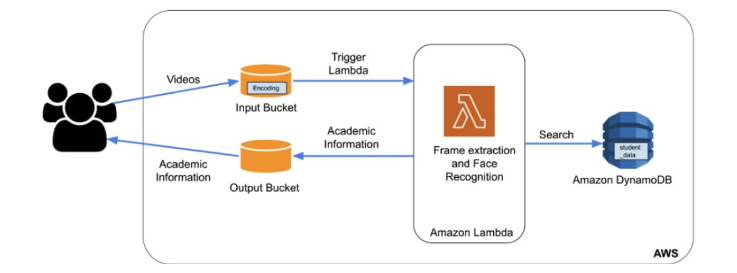

# LambdaLens : The Serverless Image Recognition Solution Powered by AWS

The primary aim of this project is to develop an application that can dynamically scale in
and scale out in response to varying workloads by utilizing AWS Lambda and other cloud
services from Amazon Web Services (AWS). The Platform as a Service (PaaS) resources,
including AWS Lambda and other tools, are instrumental in constructing this application. AWS
Lambda represents the first and currently the most extensively adopted function-based
serverless computing service. Our cloud-based application will function as a smart classroom
assistant that provides assistance to educators. The application captures videos of the
classroom, applies facial recognition technology to identify the students, and searches the
database for the academic information associated with each recognized student. Subsequently,
the application delivers this data to the user. The application's overall architecture is illustrated in
the diagram presented.

Architecture:

Components:
1. S3: Two S3 buckets are used, one for input and one for output. The input bucket has a
trigger that activates the lambda function whenever a ‘put’ object configuration is run.
2. ECR: The lambda function is deployed using ECR. Whenever there is a code update,
the new docker image should be uploaded to the Elastic Container Registry, so the
Lambda function can pull the latest image.
3. Lambda Function: The function receives the S3 notification event object, reads the
video file, splits it into frames, and identifies faces in them. It then connects to
DynamoDB, which stores additional information, processes the output, and uploads it to
the S3 output bucket in CSV format.
4. DynamoDB: It stores additional information that is queried and searched through the
lambda function.

Autoscaling:

AWS Lambda's autoscaling feature dynamically adjusts the number of function instances to
align with the incoming event rate. When a surge in traffic occurs, it scales out to increase the
number of instances and ensures that there are sufficient resources to handle the increased
load. Conversely, when the traffic volume declines, it scales in to remove idle instances and
conserve resources. This capability enables Lambda to adeptly manage varying levels of traffic,
and ensures that the functions are continually available to process events without requiring any
manual intervention from the user. As a fully managed feature by AWS, it does not demand
upfront provisioning or configuration, thus allowing the user to focus on my core application
logic.

Testing and Evaluation:

Testing was done in 2 ways:
1. Integration Test: To validate that all services were properly interconnected and
performing as intended, we carried out an integration testing process. Initially, we
inserted both dummy and pre-existing data, followed by executing a series of test cases
with extensive logging to guarantee a seamless and expected code flow.
2. Final Test using Workload generator: In the final testing phase, we employed a workload
generator to assess the application's ability to handle multiple videos as input
simultaneously, using the 100 videos provided by the TA. Additionally, we verified that
the number of CSV files stored in the S3 output bucket corresponded with the number of
videos submitted by the user.

Code:

1. Dockerfile: This file serves a critical function in producing the container image,
encompassing essential files and volumes. Its precision is of paramount importance
since it assures the successful creation of the image, which is pivotal for uploading to the
Elastic Container Registry (ECR).

2. handler.py: This file works in the following manner:
a. The function starts by reading the event that caused it to trigger.
b. It then proceeds to download the video file from the S3 bucket that caused the
trigger (input bucket), saving it in the tmp folder provided by Lambda.
c. Using the face_recognition library, the function splits the video into frames and
checks for the presence of any faces in each frame.
d. The faces found in the video are compared to the known faces provided in the
encoding file, which is read using the get_encoding() function.
e. The name of the matched face is used to search for more information in
DynamoDB, and a CSV file is generated and pushed to the S3 output bucket.

3. workload.py: This file involves subjecting our lambda function's code to various test
cases in order to thoroughly test it.
To install and execute our program, we recommend using a Dockerized environment due to
potential variations in machine setups. The following steps can be followed:
1. Install Docker.
2. Build the Docker image using the provided Dockerfile.
3. Run the Docker image.
4. Execute the handler.py handler function by accessing the container.

Here are the steps to run the program using the Lambda function:
1. Build the Docker image.
2. Push the Docker image to the ECR.
3. Create the Lambda function using the ECR image URI.
4. Set the input S3 bucket as the trigger for this Lambda function.
5. Upload video files to the input bucket. The processed results in CSV format will be
available in the output bucket.
